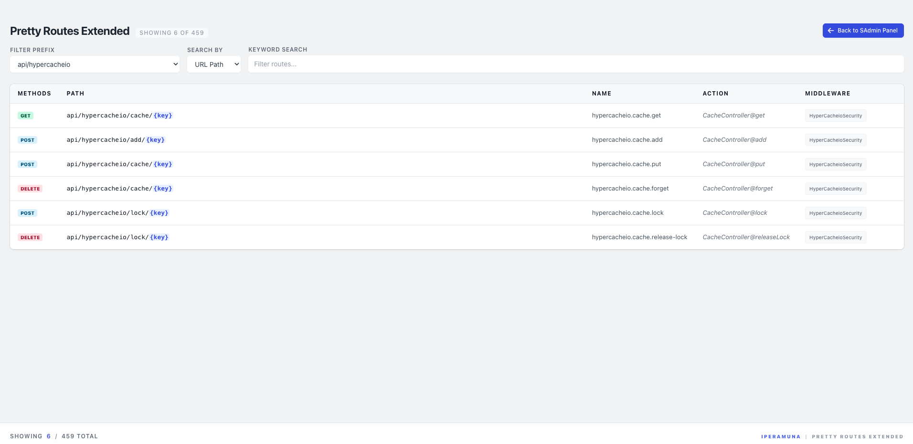

# Pretty Routes Extended

[](https://packagist.org/packages/iperamuna/pretty-routes-extended)
[](https://github.com/iperamuna/pretty-routes-extended/actions)
[](https://packagist.org/packages/iperamuna/pretty-routes-extended)
[](https://github.com/iperamuna/pretty-routes-extended/blob/main/LICENSE)



Visualise your Laravel routes in a beautiful, interactive, and searchable interface. Built with Livewire and Tailwind CSS for a premium experience.

This package is heavily inspired by and builds upon the excellent work of [garygreen/pretty-routes](https://github.com/garygreen/pretty-routes).

## Features

- ✨ **Premium UI**: Modern Tailwind CSS design with high-quality aesthetics.
- 🔍 **Real-time Search**: Search by URL, Name, or Action with instant debounced results.
- 📂 **Prefix Filtering**: Hierarchical filtering for route prefixes (e.g., `admin`, `api`).
- 📍 **Highlighting**: Toggle row highlights to track specific routes while scrolling.
- 📜 **Mirrored Scroll**: A sticky footer with a synced horizontal scrollbar for easier navigation of long URIs.
- 📊 **Statistics**: View total and filtered route counts at a glance.
- 🛠 **Configurable**: Easily toggle debug restrictions, custom URLs, and branding.

## Installation

You can install the package via composer:

```bash
composer require iperamuna/pretty-routes-extended
```

You can publish the config file with:

```bash
php artisan vendor:publish --tag="pretty-routes-extended-config"
```

This is the contents of the published config file:

```php
return [
    'url' => env('PRETTY_ROUTES_URL', 'routes'),
    'middlewares' => [
        'web',
    ],
    'debug_only' => env('PRETTY_ROUTES_DEBUG_ONLY', true),
    // ...
];
```

## Usage

Once installed, visit the `/routes` endpoint (or your custom configured URL) in your browser.

## Testing

```bash
composer test
```

## ❤️ Credits

- Developed with ❤️ by [Indunil Peramuna](https://iperamuna.online)
- Heavily inspired by [garygreen/pretty-routes](https://github.com/garygreen/pretty-routes)
- [All Contributors](../../contributors)

## License

The MIT License (MIT). Please see [License File](LICENSE) for more information.
